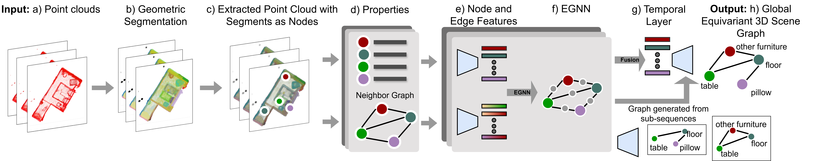

# TESGNN: 3D Temporal Equivariant Scene Graph Neural Networks



## Abstract

Scene graphs have proven to be highly effective for various scene understanding tasks due to their compact and explicit representation of relational information. However, current methods often overlook the critical importance of preserving symmetry when generating scene graphs from 3D point clouds, which can lead to reduced accuracy and robustness, particularly when dealing with noisy, multi-view data. This work, to the best of our knowledge, presents the first implementation of an Equivariant Scene Graph Neural Network (ESGNN) to generate semantic scene graphs from 3D point clouds, specifically for enhanced scene understanding. Furthermore, a significant limitation of prior methods is the absence of temporal modeling to capture time-dependent relationships among dynamically evolving entities within a scene. To address this gap, we introduce a novel temporal layer that leverages the symmetry-preserving properties of ESGNN to fuse scene graphs across multiple sequences into a unified global representation by an approximate graph-matching algorithm. Our combined architecture, termed the Temporal Equivariant Scene Graph Neural Network (TESGNN), not only surpasses existing state-of-the-art methods in scene estimation accuracy but also achieves faster convergence. Importantly, TESGNN is computationally efficient and straightforward to implement using existing frameworks, making it well-suited for real-time applications in robotics and computer vision. This approach paves the way for more robust and scalable solutions to complex multi-view scene understanding challenges.

## Prior setup

Our code base is adopted from [3D Semantic Scene Graph Estimations](https://github.com/ShunChengWu/3DSSG), a framework for developing 3D semantic scene graph estimations. The original repository includes five different methods, namely IMP, VGFM, 3DSSG, SGFN and MonoSSG. We built from this framework and added our new method, TESGNN. You can thus compare our method with the existing ones. 

Please refer to their [README.md's Preparation section](https://github.com/ShunChengWu/3DSSG?tab=readme-ov-file#preparation) to install and set up the environment, and download necessary dataset and libraries.

## ESGNN - Train and monitor result

**Train config**: The framework provides several training configs based on different methods. 

**Monitoring**: The first time you may need to change the wandb account in configs/config_default.yaml. Change the wanb.entity and wanb.project to yours. Or you can disable logging by passing --dry_run.

source Init.sh

```python
### Train single
python main_esgnn.py --mode train --config /path/to/your/config/file
### Eval one
python main_esgnn.py --mode eval --config /path/to/your/config/file
```

Using the config for ESGNN should be:
```python
python main_esgnn.py --mode train --config ./configs/config_ESGNN_full_l20.yaml
```

You can then go to WanDB and track the results. You can also compare with multiple results by running the training of other methods.

## Temporal Model Training

Updating

## Please cite our work!

```bibtex
@article{pham2024tesgnntemporalequivariantscene,
      title={TESGNN: Temporal Equivariant Scene Graph Neural Networks for Efficient and Robust Multi-View 3D Scene Understanding}, 
      author={Quang P. M. Pham and Khoi T. N. Nguyen and Lan C. Ngo and Dezhen Song and Truong Do and Truong Son Hy},
      year={2024},
      eprint={2411.10509},
      archivePrefix={arXiv},
      primaryClass={cs.CV},
      url={https://arxiv.org/abs/2411.10509}, 
}
```
